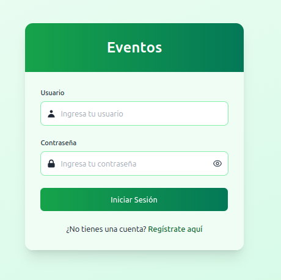
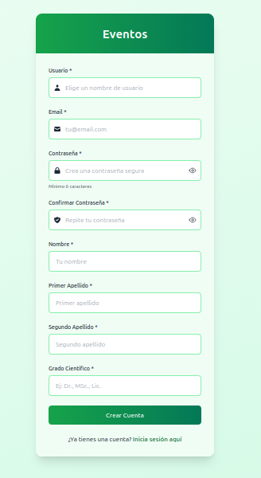
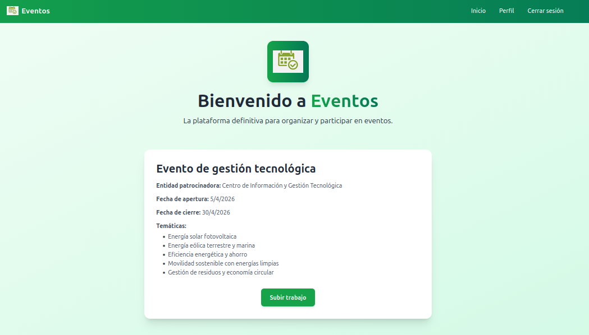
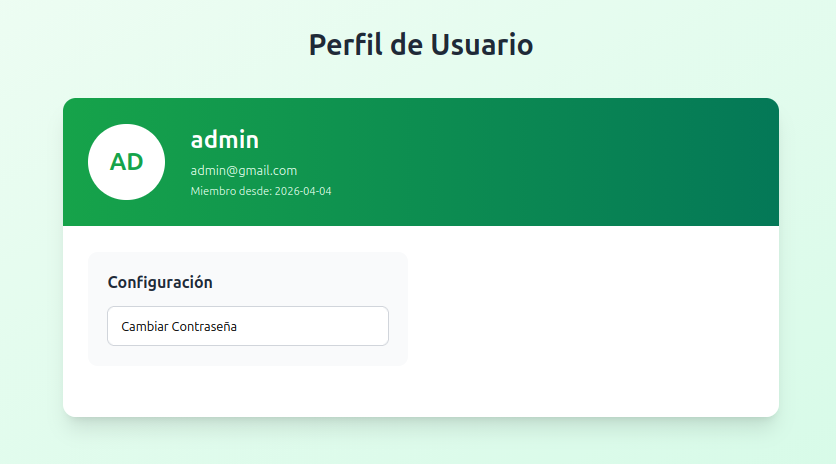
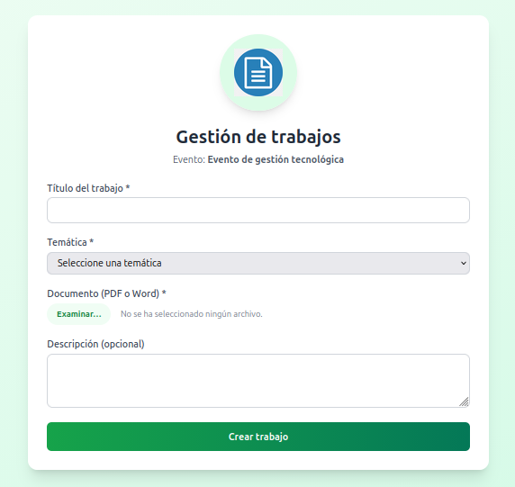
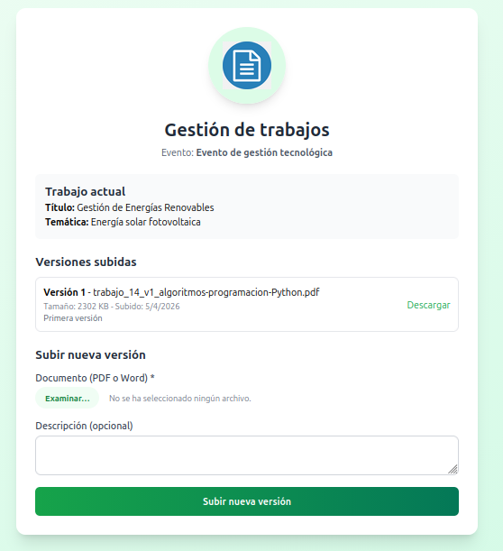
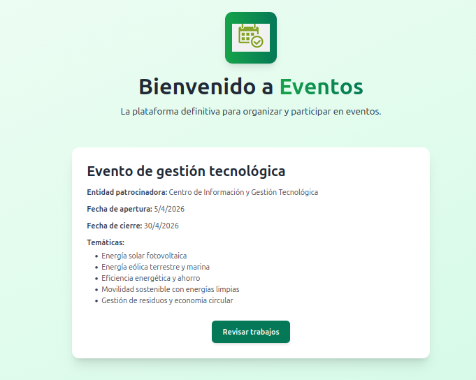
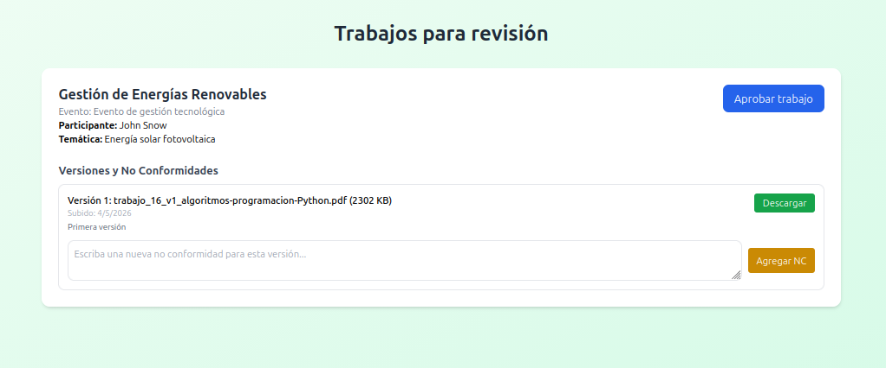
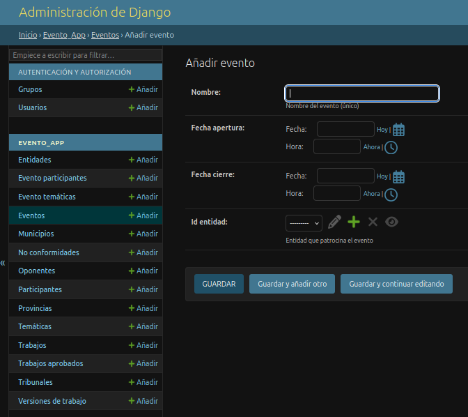
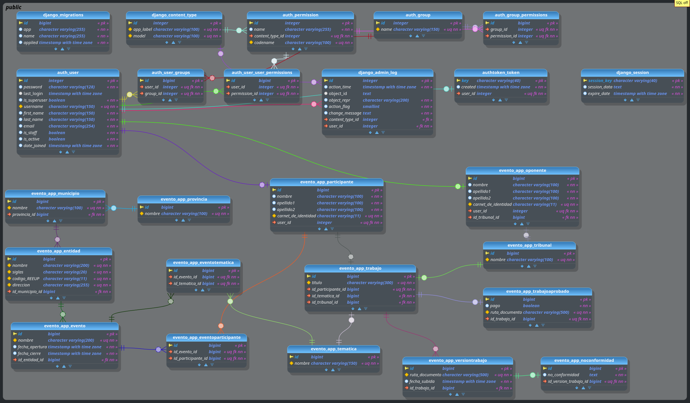

# 📅 Sistema de Gestión de Eventos - Full Stack

Aplicación web completa para la gestión integral de eventos científicos, construida con **React + TypeScript** (frontend) y **Django REST Framework** (backend). Permite a los usuarios registrarse como **participantes** (autores) u **oponentes** (revisores), subir trabajos por versiones, asignar no conformidades, aprobar trabajos y gestionar el proceso de revisión.

---

## 🚀 Tecnologías utilizadas

### Frontend
- **React 18** con TypeScript
- **React Router DOM** – navegación
- **Tailwind CSS** – estilos y diseño responsive
- **Vite** – empaquetador y servidor de desarrollo
- **Axios** (con `withCredentials` y manejo de cookies)
- **js-cookie** – lectura de token CSRF

### Backend
- **Django 5+** & **Django REST Framework (DRF)**
- **Autenticación con cookies `HttpOnly`** (token almacenado en cookie segura`)
- **Protección CSRF** mediante token enviado en cabecera `X-CSRFToken`
- **PostgreSQL** 
- **CORS headers** para comunicación segura con el frontend

---

## 📁 Estructura del proyecto


```

Proyecto/
├── backend/ # Django project
│ ├── manage.py
│ ├── requirements.txt
│ ├── evento_app/ # app principal
│ │ ├── models.py # Usuario, Participante, Oponente, Trabajo, VersionTrabajo, NoConformidad, TrabajoAprobado
│ │ ├── authentication.py # CookieTokenAuthentication personalizada
│ │ ├── views/ # auth_views, evento_views, participante_views, oponente_views
│ │ ├── urls.py
│ │ ├── admin.py
│ │ └── ...
│ └── gestion_evento/ # settings, urls globales
├── frontend/ # React + Vite
│ ├── src/
│ │ ├── api/ # auth.ts, evento.ts, participante.ts, oponente.ts, axios.ts
│ │ ├── components/ # Navegación, PrivateRoute, Auth (contexto)
│ │ ├── pages/ # Login, Registro, Inicio, Perfil, SubirTrabajo, RevisarTrabajos
│ │ ├── config/ # theme.ts, config.ts
│ │ └── img/ # logo.png, trabajo.png
│ └── package.json
└── README.md

```

--

## ⚙️ Funcionalidades principales

### 👤 Autenticación y perfiles
- Registro de nuevos usuarios
- Inicio de sesión con **cookie `HttpOnly`** (token no accesible desde JS)
- Cierre de sesión (elimina cookie y token en BD)
- Cambio de contraseña desde el perfil
- Roles:
  - **Participante**: puede crear un trabajo, subir múltiples versiones, descargar sus archivos, ver estado de aprobación y no conformidades.
  - **Oponente**: asignado a un tribunal, puede listar los trabajos de su tribunal, descargar versiones, agregar/editar/eliminar no conformidades y aprobar trabajos.

---


### 🖼️ Imágenes

**Login**



**Registro**



**Inicio**



**Perfil de usuario**



**Subir trabajo**



**Subir nueva versión del trabajo**



**Revisar trabajos**




**Revisar trabajos**




**Panel de administración**



**Modelo lógico de la aplicación**


